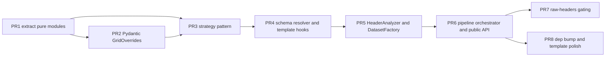

# Split `grid_overrides_v3` Into 8 Atomic PRs

## Strategy

The current branch interleaves five themes: typed config, strategy refactor, schema resolution, services, pipeline rewire, and an experimental flag move. Treat the existing branch as the **source of truth for the final state** and replay it as a stack of branches off `main`. Each PR below cherry-picks a tight subset of files; nothing earlier than PR 6 changes the runtime path of `segy_to_mdio`, so each one merges without a behavior change visible to users.

Suggested workflow per PR:

1. `git checkout -b <pr-name> origin/main`
2. `git checkout grid_overrides_v3 -- <files for this PR>`
3. Trim back anything that pulls in scope from later PRs (notes per PR below).
4. Run `nox -s pre-commit` and `nox -s tests-3.13 -- <relevant tests>` per the workspace rule.
5. Open the PR with the suggested title/summary.

---

## PR 1 - Extract pure modules into `mdio/ingestion/`

**Goal:** mechanical code move, zero behavior change. Gives the next PRs a home without dragging architecture along.

**Files (copy from branch verbatim):**
- [src/mdio/ingestion/__init__.py](src/mdio/ingestion/__init__.py) - trimmed to only re-export what this PR introduces
- [src/mdio/ingestion/header_analysis.py](src/mdio/ingestion/header_analysis.py) (the pure analysis primitives + `StreamerShotGeometryType`, `ShotGunGeometryType`, `analyze_streamer_headers`, `analyze_lines_for_guns`, `analyze_non_indexed_headers`)
- [src/mdio/ingestion/coordinate_utils.py](src/mdio/ingestion/coordinate_utils.py)
- [src/mdio/ingestion/validation.py](src/mdio/ingestion/validation.py) (`grid_density_qc`, `validate_spec_in_template`)
- [src/mdio/ingestion/metadata.py](src/mdio/ingestion/metadata.py) MINUS the `attach_raw_binary_header` import (defer to PR 7)

**Adjustments before commit:**
- In [src/mdio/ingestion/metadata.py](src/mdio/ingestion/metadata.py), drop `from mdio.ingestion._raw_headers_experimental import attach_raw_binary_header` and its call inside `add_segy_file_headers`. Inline the existing on-`main` raw-binary handling instead, or stub it as a TODO (PR 7 reintroduces the gating module).
- Trim `__init__.py` exports to only the symbols actually defined in this PR.
- Update import sites in `mdio/converters/segy.py` and any other on-`main` callers to point at the new module locations.

**Tests:** existing tests must pass unchanged (`nox -s tests-3.13`).

**PR title:** `refactor(ingestion): extract analysis, coordinate, validation, and metadata helpers`

---

## PR 2 - Add Pydantic `GridOverrides` (additive)

**Goal:** the typed model lands as a public class, dict path stays alive internally.

**Files:**
- [src/mdio/segy/geometry.py](src/mdio/segy/geometry.py) - add the `GridOverrides` class **alongside** the existing `GridOverrider` (do not delete `GridOverrider` yet).
- [src/mdio/converters/segy.py](src/mdio/converters/segy.py) - add the `isinstance(grid_overrides, dict)` shim with `DeprecationWarning` and `GridOverrides.from_legacy_dict(...)` coercion. After coercion, immediately re-dump to dict via `model_dump(by_alias=True, exclude_defaults=True)` so the still-on-`main` `GridOverrider` keeps receiving the dict it expects.
- [src/mdio/__init__.py](src/mdio/__init__.py) - add `GridOverrides` to `__all__` and imports.
- [tests/unit/test_grid_overrides_pydantic.py](tests/unit/test_grid_overrides_pydantic.py) - new file, copy as-is.

**Acceptance:** existing `tests/unit/test_segy_grid_overrides.py` (which imports `GridOverrider`) still passes; `test_grid_overrides_pydantic.py` passes.

**PR title:** `feat(api): typed Pydantic GridOverrides with legacy dict deprecation`

**Changelog line:** "`mdio.GridOverrides` is now the supported way to configure grid overrides. Passing a `dict` still works but emits a `DeprecationWarning`."

---

## PR 3 - Replace `GridOverrider` with strategy pattern

**Goal:** the "modernization to grid override code" PR you called out. Behavior preserved; the monolithic `GridOverrider.run(...)` becomes `IndexStrategyRegistry().create_strategy(...)` returning composable `IndexStrategy` instances.

**Files:**
- [src/mdio/ingestion/index_strategies.py](src/mdio/ingestion/index_strategies.py) - new (`IndexStrategy` ABC + `RegularGridStrategy`, `NonBinnedStrategy`, `DuplicateHandlingStrategy`, `ChannelWrappingStrategy`, `ShotWrappingStrategy`, `ComponentSynthesisStrategy`, `CompositeStrategy`, `IndexStrategyRegistry`).
- [src/mdio/segy/geometry.py](src/mdio/segy/geometry.py) - rewrite `GridOverrider.run(...)` as a thin shim: build a `GridOverrides` from the input dict, call `IndexStrategyRegistry`, return the `(headers, names, chunks)` tuple shape that callers expect. Keep the public signature unchanged.
- [tests/unit/test_ingestion_index_strategies.py](tests/unit/test_ingestion_index_strategies.py) - new.
- [tests/unit/test_segy_grid_overrides.py](tests/unit/test_segy_grid_overrides.py) - **fix**: the file currently imports `GridOverrider` and `TemplateRegistry`; either keep the shim alive (above) so this file passes unchanged, or rewrite each test to drive `IndexStrategyRegistry` directly. The branch leaves it in a broken-import state, which is the kind of footgun this PR should clean up.

**Acceptance:** integration tests `tests/integration/test_import_obn_grid_overrides.py` and `tests/integration/test_import_streamer_grid_overrides.py` pass; new strategy unit tests pass; old `test_segy_grid_overrides.py` either passes or is replaced.

**PR title:** `refactor(ingestion): split GridOverrider into composable IndexStrategy classes`

---

## PR 4 - Schema resolution + template-aware dimension layout

**Goal:** declarative final-schema description; templates stop having ingestion poke private attributes.

**Files:**
- [src/mdio/ingestion/schema_resolver.py](src/mdio/ingestion/schema_resolver.py) - new (`DimensionSpec`, `CoordinateSpec`, `ResolvedSchema`, `SchemaResolver`).
- [src/mdio/builder/templates/base.py](src/mdio/builder/templates/base.py) - add `declare_coordinate_specs()` (default impl over `physical_coordinate_names` + `logical_coordinate_names`) and `apply_resolved_dimensions(dim_names, chunk_shape)`. Add the `synthesize_missing_dims` and `_calculated_dims` attributes.
- Per-template overrides only where the default isn't right:
  - [src/mdio/builder/templates/seismic_3d_obn.py](src/mdio/builder/templates/seismic_3d_obn.py) - per-shot-dim coord specs, `_calculated_dims = ("shot_index",)`, `synthesize_missing_dims = ("component",)`.
  - [src/mdio/builder/templates/seismic_3d_streamer_field.py](src/mdio/builder/templates/seismic_3d_streamer_field.py)
  - [src/mdio/builder/templates/seismic_3d_coca.py](src/mdio/builder/templates/seismic_3d_coca.py)
  - [src/mdio/builder/templates/seismic_3d_cdp.py](src/mdio/builder/templates/seismic_3d_cdp.py), [src/mdio/builder/templates/seismic_2d_cdp.py](src/mdio/builder/templates/seismic_2d_cdp.py) - inline/crossline-indexed `cdp_x`/`cdp_y` specs.
- [tests/unit/test_ingestion_schema_resolver.py](tests/unit/test_ingestion_schema_resolver.py) - new.

**Adjustments:** nothing in this PR consumes `ResolvedSchema` at runtime - the resolver is dead code until PR 5/6 wire it. That is intentional.

**Acceptance:** all template tests under `tests/unit/v1/templates/` still pass; new resolver tests pass.

**PR title:** `feat(ingestion): declarative ResolvedSchema and template-driven coordinate specs`

---

## PR 5 - `HeaderAnalyzer` + `DatasetFactory`

**Goal:** add the two small services that PR 6 will compose. They have a real changelog bullet on their own ("ingestion now reads only the headers required by the resolved schema").

**Files:**
- [src/mdio/ingestion/header_analyzer.py](src/mdio/ingestion/header_analyzer.py)
- [src/mdio/ingestion/dataset_factory.py](src/mdio/ingestion/dataset_factory.py)
- [tests/unit/test_ingestion_header_analyzer.py](tests/unit/test_ingestion_header_analyzer.py)
- [tests/unit/test_ingestion_dataset_factory.py](tests/unit/test_ingestion_dataset_factory.py)

**Adjustments:** still no runtime use; pipeline switch is PR 6.

**Acceptance:** new unit tests pass; everything else unchanged.

**PR title:** `feat(ingestion): HeaderAnalyzer and DatasetFactory services`

---

## PR 6 - Pipeline orchestrator + public API surface (the minor-version-bump PR)

**Goal:** wire PRs 2-5 into a single `run_segy_ingestion`, replace the body of `segy_to_mdio` with a thin shim, surface the new public types.

**Files:**
- [src/mdio/ingestion/pipeline.py](src/mdio/ingestion/pipeline.py) - new (`run_segy_ingestion`).
- [src/mdio/converters/segy.py](src/mdio/converters/segy.py) - body becomes the dict-deprecation shim + delegate to `run_segy_ingestion`. The `noqa: PLR0913` and old-style internals go away.
- [src/mdio/ingestion/__init__.py](src/mdio/ingestion/__init__.py) - expand to the full `__all__` from the branch.
- [src/mdio/__init__.py](src/mdio/__init__.py) - add `run_segy_ingestion`, `IndexStrategy`, `IndexStrategyRegistry`, `ResolvedSchema`, `CoordinateSpec`, `DimensionSpec`.
- [src/mdio/segy/geometry.py](src/mdio/segy/geometry.py) - **delete** the legacy `GridOverrider` shim that PR 3 kept alive. All callers now route through `run_segy_ingestion`.
- [src/mdio/commands/segy.py](src/mdio/commands/segy.py) - **fix the broken CLI**: it currently calls `segy_to_mdio(segy_path=..., index_bytes=..., index_names=..., chunksize=...)`, none of which match the v1 signature in `converters/segy.py`. Either update the CLI to construct a `SegySpec` + `mdio_template` + `GridOverrides` and call `segy_to_mdio` correctly, or wrap it in a `# TODO(v1.3): rewrite CLI for v1 API` and skip it from CI. Pick one explicitly; do not leave it silently broken.

**Acceptance:** full `nox -s tests-3.13` passes; integration tests under `tests/integration/` pass; example notebooks (if any) still run.

**PR title:** `feat(ingestion): run_segy_ingestion orchestrator and v1.2 public API`

**Changelog highlights:**
- New public functions/classes: `run_segy_ingestion`, `IndexStrategy`, `IndexStrategyRegistry`, `ResolvedSchema`, `CoordinateSpec`, `DimensionSpec`.
- `segy_to_mdio` retained as a v1.x compatibility entry point.
- Memory: ingestion now only parses headers required by the resolved schema (`HeaderAnalyzer`).

---

## PR 7 - Gate experimental raw-headers behind `_raw_headers_experimental.py`

**Goal:** isolate the `MDIO__IMPORT__RAW_HEADERS` feature so removing it later is a one-file delete.

**Files:**
- [src/mdio/ingestion/_raw_headers_experimental.py](src/mdio/ingestion/_raw_headers_experimental.py) - new. The module's own docstring is the PR description; copy it into the PR body.
- [src/mdio/ingestion/pipeline.py](src/mdio/ingestion/pipeline.py) - call `maybe_add_raw_headers(mdio_template, mdio_ds)` after `DatasetFactory().build(...)`.
- [src/mdio/ingestion/metadata.py](src/mdio/ingestion/metadata.py) - re-add the `attach_raw_binary_header` import + call inside `add_segy_file_headers` (the inverse of the trim in PR 1).
- [src/mdio/builder/templates/base.py](src/mdio/builder/templates/base.py) - keep the `_add_raw_headers` method (defined in PR 4) in place; no change here unless the prior PR omitted it.

**Acceptance:** with `MDIO__IMPORT__RAW_HEADERS=1` and Zarr v3, raw_headers variable appears in output; without the env var, no behavior change.

**PR title:** `refactor: gate experimental raw-headers feature behind a single module`

---

## PR 8 - Dep bump + template polish

**Goal:** the leftover small stuff. Optional; can ride along with PR 6 if reviewers prefer.

**Files:**
- [uv.lock](uv.lock)
- Per-template polish in [src/mdio/builder/templates/](src/mdio/builder/templates/) (`_dim_names`/`_calculated_dims` cleanup, dead-method removal).

**Acceptance:** full test suite green; `nox -s pre-commit` clean.

**PR title:** `chore(deps): bump dependencies and polish template internals`

---

## Risks & coupling notes

- **PR 4-6 are the tightest cluster.** PR 4's `ResolvedSchema` is dead code at merge time, PR 5's services are dead code at merge time, PR 6 flips runtime. This staging is intentional - it keeps each diff small and reviewable, at the cost of two PRs that "do nothing yet". If reviewers push back on dead code, fold PRs 4 and 5 together but **never** fold them into PR 6.
- **PR 3 must keep `GridOverrider` callable** until PR 6 deletes it, otherwise existing callers in `mdio/converters/segy.py` (still on the v1.1 path) break mid-stack.
- **`tests/unit/test_segy_grid_overrides.py`** is currently broken on the branch (imports a `GridOverrider` symbol that no longer exists in `mdio.segy.geometry`). PR 3 is the place to fix it. Do not let it land broken in a separate PR.
- **CLI in `mdio/commands/segy.py`** has the same problem (calls v0-style `segy_to_mdio(segy_path=..., index_bytes=..., ...)`). PR 6 must either fix or explicitly defer with a tracked issue - this would be very embarrassing in a release notes diff.
- **Autodocs.** The split gives ~8 changelog bullets instead of one "big refactor" line. PR 2 (typed config), PR 3 (strategy pattern), PR 5 (memory win), and PR 6 (new public API) are all release-note-worthy on their own.

## Suggested merge order for the next two minor releases

- v1.2: PRs 1, 2, 7 (no runtime change, deprecation only, easy to revert).
- v1.3: PRs 3, 4, 5, 6, 8 (the actual architectural turn, with the orchestrator landing in PR 6 as the headline).
